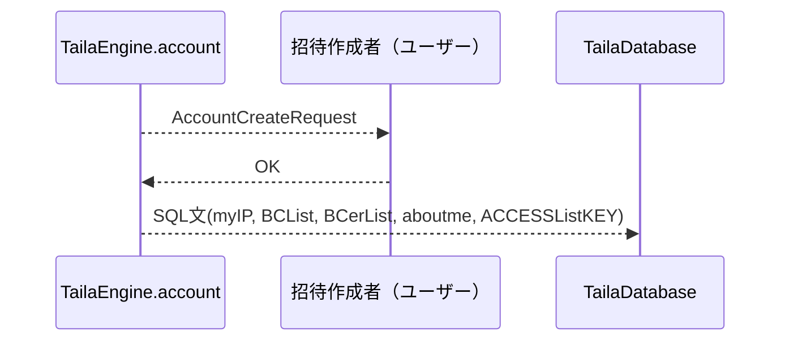

**ユーザーが最初に水Protocolを使うためのステップ**


### 概説

水Protocolは通常のTCP/IP上のプロトコル（httpなど）とは違い、水Protocolを使うにはすでに存在する水ユーザーから招待を受ける必要があります。

招待状はリアルの友達やすでに他のサービスでつながっている友達などから取得する必要があります。

これによりP2P通信の際にシグナリングサーバーを必要とせずに通信を行えます。

招待状は

- 招待状を作成したユーザーのIPアドレス
- 招待状招待コードのhash

を含んだデータで構成されます。

招待状を受けたユーザーは招待コードを入力し、hash化して招待状に付属している招待コードと照らし合わせを行い招待状を生成したユーザーが本人であることを確認します。

招待生成者のIPアドレスへアカウントリンクリクエストを送信します。

アカウントリンクリクエストの返答が招待生成者から返答された場合DBへの登録を行います。

DB登録

- 自分のIPアドレス(myIP)
- 自分を購読しているユーザーリスト(BCList)
- 自分が購読しているユーザーリスト(BCerList)
- 自分の基本情報(aboutme)
- DBへのアクセスを許可するアプリケーションリストとそのアクセスkey(ACCESSListKEY)
- 自分を評価しているユーザーIPリスト（truthList）

### For Developer

#### 招待状:

Data:
```json
{
  "IP": "ここにIPアドレス",
  "hash": "招待コードのハッシュ"
}
```

hyperlink:

```
taila://identity.createaccount
```

Package:


UI:


#### シーケンス:
